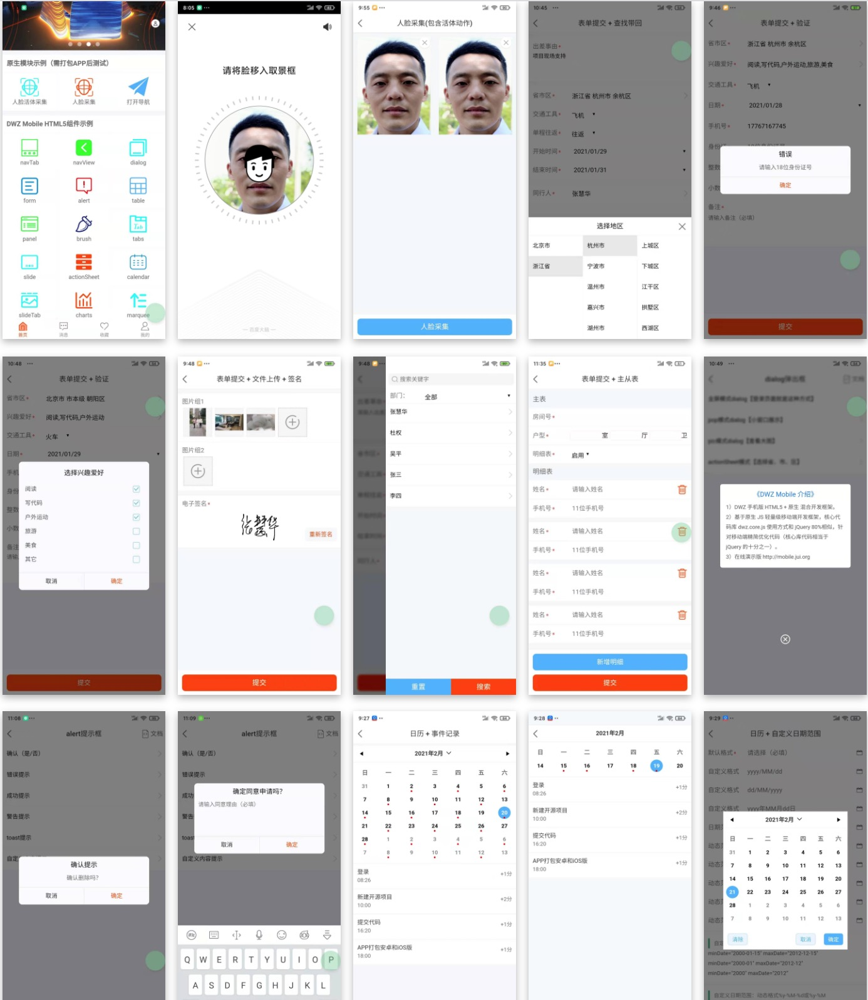

> ## 介绍

github源码下载：https://github.com/dwzteam/dwz_jui

DWZ富客户端框架(jQuery RIA framework), 是中国人自己开发的基于jQuery实现的Ajax RIA开源框架.

DWZ富客户端框架设计目标是<b>简单实用、扩展方便、快速开发、RIA思路、轻量级</b>

DWZ支持用html扩展的方式来代替javascript代码, 基本可以保证程序员不懂javascript, 也能使用各种页面组件和ajax技术. 如果有特定需求也可以扩展DWZ做定制化开化.

国内很多程序员javascript不熟, 大大影响了开发速度. 使用DWZ框架自动邦定javascript效果. 不需要开发人员去关心javascript怎么写, 只要写标准html就可以了. DWZ简单扩展了html标准, 给HTML定义了一些特别的class 和attribute. DWZ框架会找到当前请求结果中的那些特别的class 和attribute, 并自动关联上相应的js处理事件和效果.

DWZ基于jQuery可以非常方便的定制特定需求的UI组件, 并以jQuery插件的形式发布.

欢迎大家提出建议, 我们将在下一版本中进一步调整和完善功能。

DWZ富客户端框架完全开源，可以免费获取全部源码。团队中的每个人都是开源的拥护者，都希望为中国软件开源事业尽自己的一份力量。

DWZ官方微博 http://weibo.com/dwzui
在线演示地址 http://jui.org

### 学习DWZ的建议
- 通读DWZ文档，很多新手提的问题文档中都写了
- 看demo每个组件演示效果和代码（留意组件html结构）
- 建议安装firebug，用firebug看html结构、CSS和调试JS都非常方便。见附录一 firebug介绍
- 对于初学者不建议看DWZ全部源码，但还是非常有必要看看dwz.ui.js和dwz.ajax.js
- 可以从google code下载dwz_thinkphp版本，结合php后台去理解DWZ和服务器端的交互方式

### DWZ区别于其它JS框架，最大的优点

- 完全开源，源码没有做任何混淆处理，方便扩展
- CSS和js代码彻底分离，修改样式方便
- 简单实用，扩展方便，轻量级框架，快速开发
- 仍然保留了html的页面布局方式
- 支持HTML扩展方式调用UI组件，开发人员不需写js
- 只要懂html语法不需精通js，就可以使用ajax开发后台
- 基于jQuery，UI组件以jQuery插件的形式发布，扩展方便

### 有偿服务
- 公司培训，技术支持，解决使用jUI过程中出现的全部疑难问题
- 定制化开发

### 联系方式

	合作电话：18600055221
	技术支持：17767167745
	邮箱：support@jui.org

	DWZ创始人：
	[北京]杜权(UI设计/制作)	d@jui.org
	[杭州]吴平(Ajax开发)	w@jui.org
	[杭州]张慧华(Ajax开发)	z@jui.org

	新加入成员：
	[北京]张涛	QQ:122794105
	[北京]冀刚	QQ:63502308	jiweigang2008@tom.com
	[南京]郑应海	QQ:55691650
	[成都]COCO	QQ:80095667

	官方微博(欢迎加入) http://weibo.com/dwzui 

	jQuery.DWZ-jUI-1群 369203
	jQuery.DWZ-jUI-2群 69611933
	jQuery.DWZ-jUI-3群 20866231
	jQuery.DWZ-jUI-5群 85031937
	jQuery.DWZ-jUI-6群 172602882
	jQuery.DWZ-jUI-7群 210322217
	jQuery.DWZ-jUI-8群 139067378
	jQuery.DWZ-jUI-9群 59680552
	jQuery.DWZ-jUI-10群 329597326

### 技术服务微信

> ## DWZ 移动端框架

- 在线演示版，使用chrome 开发模式设置手机版：`http://mobile.jui.org`
- git源码：`https://gitee.com/dwzteam/dwz_mobile_app`
- 在线文档：`http://dwzteam.gitee.io/dwz_mobile_doc_v1`
- 安卓 Apk 安装测试版：`http://mobile.jui.org/apk/dwz_mobile_app.apk`

## 捐助

如果您觉得我们的开源软件对你有所帮助，请扫下方二维码打赏我们一杯咖啡。

|支付宝|微信|
|:---:|:---:|
|||

<b>版权声明:</b>

	jUI遵循Apache2开源协议发布，并提供免费使用。
	版权所有Copyright © 2009-2020 by DWZ (http://jui.org) All rights reserved。
	Apache Licence是著名的非盈利开源组织Apache采用的协议。
	该协议和BSD类似，鼓励代码共享和尊重原作者的著作权，允许代码修改，再作为开源或商业软件发布。需要满足的条件： 
	
	需要给代码的用户一份Apache Licence
	如果你修改了代码，需要在被修改的文件中说明
	在延伸的代码中（修改和有源代码衍生的代码中）需要带有原来代码中的协议，商标，专利声明和其他原来作者规定需要包含的说明
	如果再发布的产品中包含一个Notice文件，则在Notice文
	件中需要带有本协议内容。你可以在Notice中增加自己的许可，但不可以表现为对Apache Licence构成更改
	
具体的协议参考：http://www.apache.org/licenses/LICENSE-2.0

	THIS SOFTWARE IS PROVIDED BY THE COPYRIGHT HOLDERS AND CONTRIBUTORS"AS IS" AND ANY EXPRESS OR IMPLIED WARRANTIES, INCLUDING, BUT NOTLIMITED TO, THE IMPLIED WARRANTIES OF MERCHANTABILITY AND FITNESSFOR A PARTICULAR PURPOSE ARE DISCLAIMED. IN NO EVENT SHALL THECOPYRIGHT OWNER OR CONTRIBUTORS BE LIABLE FOR ANY DIRECT, INDIRECT,INCIDENTAL, SPECIAL, EXEMPLARY, OR CONSEQUENTIAL DAMAGES (INCLUDING,BUT NOT LIMITED TO, PROCUREMENT OF SUBSTITUTE GOODS OR SERVICES;LOSS OF USE, DATA, OR PROFITS; OR BUSINESS INTERRUPTION) HOWEVERCAUSED AND ON ANY THEORY OF LIABILITY, WHETHER IN CONTRACT, STRICTLIABILITY, OR TORT (INCLUDING NEGLIGENCE OR OTHERWISE) ARISING INANY WAY OUT OF THE USE OF THIS SOFTWARE, EVEN IF ADVISED OF THEPOSSIBILITY OF SUCH DAMAGE.
	
